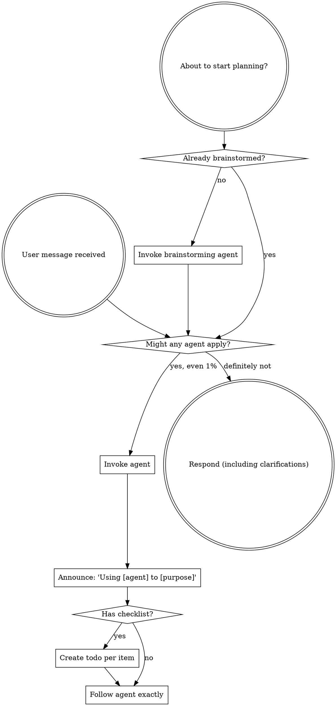

<SUBAGENT-STOP>
If you were dispatched as a subagent to execute a specific task, skip this agent.
</SUBAGENT-STOP>

<EXTREMELY-IMPORTANT>
If you think there is even a 1% chance an agent might apply to what you are doing, you ABSOLUTELY MUST invoke the agent.

IF AN AGENT APPLIES TO YOUR TASK, YOU DO NOT HAVE A CHOICE. YOU MUST USE IT.

This is not negotiable. This is not optional. You cannot rationalize your way out of this.
</EXTREMELY-IMPORTANT>

## Instruction Priority

Agent instructions override default system prompt behavior, but **user instructions always take precedence**:

1. **User's explicit instructions** (CLAUDE.md, GEMINI.md, AGENTS.md, direct requests) ??highest priority
2. **Agent instructions** ??override default system behavior where they conflict
3. **Default system prompt** ??lowest priority

If CLAUDE.md, GEMINI.md, or AGENTS.md says "don't use TDD" and an agent says "always use TDD," follow the user's instructions. The user is in control.

## How to Access Agents

Agents are defined as `.agent.md` files in the `agents/` directory. Each agent contains specialized instructions for a specific workflow or task type.

## Platform Adaptation

Agents use Claude Code tool names. Non-CC platforms: see `using-superpowers/references/codex-tools.md` (Codex) for tool equivalents.

# Using Agents

## The Rule

**Invoke relevant or requested agents BEFORE any response or action.** Even a 1% chance an agent might apply means that you should invoke the agent to check. If an invoked agent turns out to be wrong for the situation, you don't need to use it.

## Red Flags

These thoughts mean STOP?”you're rationalizing:

| Thought | Reality |
|---------|---------|
| "This is just a simple question" | Questions are tasks. Check for agents. |
| "I need more context first" | Agent check comes BEFORE clarifying questions. |
| "Let me explore the codebase first" | Agents tell you HOW to explore. Check first. |
| "I can check git/files quickly" | Files lack conversation context. Check for agents. |
| "Let me gather information first" | Agents tell you HOW to gather information. |
| "This doesn't need a formal agent" | If an agent exists, use it. |
| "I remember this agent" | Agents evolve. Read current version. |
| "This doesn't count as a task" | Action = task. Check for agents. |
| "The agent is overkill" | Simple things become complex. Use it. |
| "I'll just do this one thing first" | Check BEFORE doing anything. |
| "This feels productive" | Undisciplined action wastes time. Agents prevent this. |
| "I know what that means" | Knowing the concept ??using the agent. Invoke it. |

## Agent Priority

When multiple agents could apply, use this order:

1. **Process agents first** (brainstorming, systematic-debugging) - these determine HOW to approach the task
2. **Implementation agents second** - these guide execution
