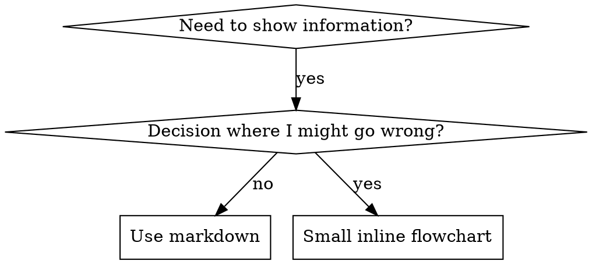

# Writing Agents

## Overview

**에이전트 작성은 TDD를 프로세스 문서에 적용한 것이다.**

에이전트는 `.agent.md` 파일로 정의되며, `.github/agents/` 디렉터리에 위치한다. 각 에이전트는 YAML frontmatter와 Markdown 본문으로 구성된다.

**Core principle:** 에이전트가 없을 때 실패하는 것을 먼저 확인하지 않으면, 에이전트가 올바른 것을 가르치는지 알 수 없다.

**REQUIRED BACKGROUND:** `test-driven-development` 에이전트의 RED-GREEN-REFACTOR 사이클을 이해해야 한다.

## What is an Agent?

**에이전트(Agent)** 는 VS Code Copilot에서 특정 워크플로우나 작업 유형에 대한 전문 지침을 담은 `.agent.md` 파일이다.

**에이전트는:** 특정 워크플로우의 단계별 가이드, 의사결정 트리, 품질 기준

**에이전트는 아닌 것:** 일반적인 코딩 팁, 한 번 쓰는 스크립트, 프로젝트별 설정 (그건 AGENTS.md에)

## When to Create an Agent

**Create when:**
- 워크플로우가 직관적이지 않아 반복적으로 실수가 발생
- 여러 프로젝트에서 재사용할 패턴
- 다른 사람도 이 워크플로우를 따라야 할 때

**Don't create for:**
- 일회성 작업
- 이미 잘 문서화된 표준 관행
- 프로젝트별 설정 (AGENTS.md에)

## TDD Mapping for Agents

| TDD Concept | Agent Creation |
|-------------|----------------|
| **Test case** | 에이전트 없이 작업 수행하는 시나리오 |
| **Production code** | 에이전트 파일 (`.agent.md`) |
| **Test fails (RED)** | 에이전트 없이 작업 시 품질 저하 또는 규칙 위반 확인 |
| **Test passes (GREEN)** | 에이전트 적용 후 규칙 준수 확인 |
| **Refactor** | 허점을 발견하고 보강하되 기존 동작 유지 |

## Agent 파일 구조

### YAML Frontmatter

모든 `.agent.md` 파일은 YAML frontmatter로 시작한다:

```yaml
---
description: "Use when [triggering conditions] - [key behavior]"
model: inherit
handoffs:
  - label: "한국어 레이블 (English Label)"
    agent: target-agent-name
    prompt: "Context to pass to target agent"
    send: false
---
```

**필수 필드:**
- `description` — 에이전트가 활성화되는 조건. "Use when..."으로 시작
- `model` — 사용할 모델. 보통 `inherit`

**선택 필드:**
- `handoffs` — 다른 에이전트로의 핸드오프 정의
  - `label` — 한국어+영어 이중 표기 사용
  - `agent` — 대상 에이전트의 파일명 (`.agent.md` 확장자 제외)
  - `prompt` — 대상 에이전트에 전달할 컨텍스트
  - `send: false` — 사용자 확인 후 핸드오프 (자동 핸드오프 아님)
- `tools` — 에이전트가 사용 가능한 도구 제한

### Description 작성 규칙

**CRITICAL: Description = When to Use, NOT What the Agent Does**

Description은 트리거 조건만 기술한다. 에이전트의 프로세스나 워크플로우를 요약하지 않는다.

```yaml
# BAD: 워크플로우를 요약 — AI가 본문을 읽지 않고 description으로 동작할 수 있음
description: Use when executing plans - dispatches subagent per task with code review between tasks

# GOOD: 트리거 조건만
description: Use when executing implementation plans with independent tasks in the current session
```

### 디렉터리 구조

```
.github/agents/
  agent-name.agent.md        # 에이전트 파일 (필수)
  agent-name/                 # 지원 파일 디렉터리 (선택)
    supporting-file.md        # 참조 문서, 프롬프트 등
```

**Flat namespace** — 모든 에이전트가 `.github/agents/` 에 위치

**지원 파일 분리 기준:**
1. 100줄 이상의 참조 문서
2. 재사용 가능한 프롬프트 또는 스크립트
3. 그 외는 에이전트 본문에 인라인

### Cross-Referencing Other Agents

에이전트를 참조할 때는 에이전트 이름만 사용하고 명시적 요구 마커를 붙인다:
- Good: `**REQUIRED:** Use the \`test-driven-development\` agent`
- Bad: `See skills/testing/test-driven-development` (필수인지 불명확)

## Flowchart Usage



**Use flowcharts ONLY for:**
- Non-obvious decision points
- Process loops where you might stop too early
- "When to use A vs B" decisions

**Never use flowcharts for:**
- Reference material → Tables, lists
- Code examples → Markdown blocks
- Linear instructions → Numbered lists
- Labels without semantic meaning (step1, helper2)

## File Organization

### 독립 에이전트 (Self-Contained)
```
.github/agents/
  my-agent.agent.md    # 모든 내용 인라인
```
적용: 내용이 한 파일에 담길 때

### 지원 파일 포함 에이전트
```
.github/agents/
  my-agent.agent.md       # 메인 로직
  my-agent/
    reference.md          # 참조 문서
    prompt-template.md    # 서브에이전트 프롬프트
```
적용: 참조 문서가 길거나 재사용 프롬프트가 있을 때

## The Iron Law (TDD 원칙과 동일)

```
NO AGENT WITHOUT A FAILING TEST FIRST
```

새 에이전트를 만들기 전에 에이전트 없이 작업을 수행하여 실패를 확인한다.
기존 에이전트를 수정하기 전에도 현재 상태에서의 문제를 먼저 확인한다.

**예외 없음:**
- "간단한 추가"도 예외 아님
- "문서 업데이트"도 예외 아님
- 테스트 없이 변경한 내용은 유지하지 않는다

**REQUIRED BACKGROUND:** `test-driven-development` 에이전트가 왜 이것이 중요한지 설명한다. 동일한 원칙이 에이전트 문서에도 적용된다.

## Common Rationalizations for Skipping Testing

| Excuse | Reality |
|--------|---------|
| "에이전트가 명확하다" | 나에게 명확 ≠ 다른 AI에게 명확. 테스트하라. |
| "참조 문서일 뿐이다" | 참조에도 빈틈이 있다. 테스트하라. |
| "테스트가 과하다" | 테스트 안 한 에이전트는 항상 문제가 있다. |
| "문제가 생기면 테스트하겠다" | 문제 = 이미 실패. 배포 전에 테스트하라. |
| "자신 있다" | 과신이 문제를 보장한다. 어쨌든 테스트하라. |

## Bulletproofing Agents Against Rationalization

규율을 강제하는 에이전트(TDD 등)는 합리화에 저항해야 한다.

### Close Every Loophole Explicitly

규칙만 명시하지 말고, 구체적인 우회로를 금지한다:

```markdown
Write code before test? Delete it. Start over.

**No exceptions:**
- Don't keep it as "reference"
- Don't "adapt" it while writing tests
- Delete means delete
```

### Address "Spirit vs Letter" Arguments

초반에 기본 원칙을 추가한다:

```markdown
**Violating the letter of the rules is violating the spirit of the rules.**
```

### Build Rationalization Table

베이스라인 테스트에서 발견한 합리화를 모두 테이블에 기록한다.

## 배포 (Deployment)

에이전트 파일은 `extension.ts`가 익스텐션 활성화 시 자동으로 `~/.superpowers-copilot/agents/`에 복사한다. 새 에이전트를 추가하면:

1. `.github/agents/` 에 `.agent.md` 파일 생성
2. 지원 파일이 있으면 같은 이름의 디렉터리 생성
3. 익스텐션 재빌드 후 활성화하면 자동 배포됨

별도의 등록 코드는 불필요 — 디렉터리 복사가 재귀적으로 동작한다.
